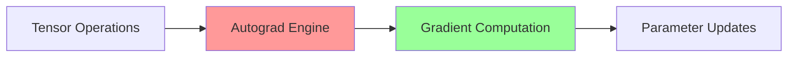
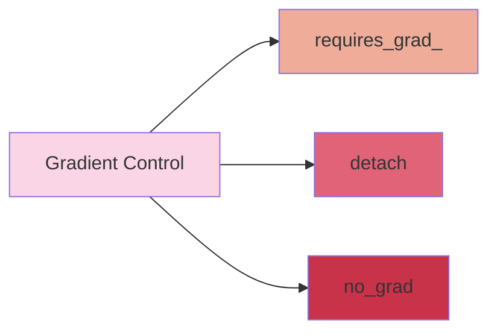

# PyTorch Autograd Implementation Guide 🔄

## Understanding the Example Chain Rule Applications 📊

Let's break down the three examples shown in the images to understand PyTorch's autograd implementation requirements.

### 1. Basic Derivative Computation 📝
```python
y = x²
dy/dx = 2x
```
When x = 2: dy/dx = 4
When x = 3: dy/dx = 6

### 2. Two-Layer Chain Rule 🔗
```python
y = x²
z = sin(y)
```
Using chain rule:
dz/dx = dz/dy * dy/dx
     = cos(y) * 2x
     = cos(x²) * 2x

### 3. Three-Layer Chain Rule 📈
```python
y = x²
z = sin(y)
u = eᶻ
```

## PyTorch Implementation ⚡

Let's create a complete implementation that handles these cases:

## Key Implementation Features 🎯

1. **Base AutogradFunction Class**
   - Handles tensor storage for backward pass
   - Defines forward/backward interface

2. **Individual Function Classes**
   - `Square`: Implements y = x²
   - `Sin`: Implements z = sin(y)
   - `Exp`: Implements u = eᶻ

3. **Backward Pass Implementation**
   - Each class implements its specific derivative
   - Chain rule applied automatically through composition

## Running the Examples 🚀

The implementation includes test cases that demonstrate:
1. Simple derivative: dy/dx where y = x²
2. Two-layer chain rule: dz/dx where z = sin(x²)
3. Three-layer chain rule: du/dx where u = e^(sin(x²))

```
import torch

class AutogradFunction:
    def __init__(self):
        self.saved_tensors = {}
        
    def save_for_backward(self, *args):
        """Save tensors needed for backward pass"""
        self.saved_tensors = args
        
    @staticmethod
    def forward(ctx, x):
        raise NotImplementedError
        
    @staticmethod
    def backward(ctx, grad_output):
        raise NotImplementedError

class Square(AutogradFunction):
    @staticmethod
    def forward(ctx, x):
        """Compute y = x²"""
        ctx.save_for_backward(x)
        return x * x
    
    @staticmethod
    def backward(ctx, grad_output):
        """Compute dy/dx = 2x"""
        x, = ctx.saved_tensors
        return 2 * x * grad_output

class Sin(AutogradFunction):
    @staticmethod
    def forward(ctx, x):
        """Compute z = sin(x)"""
        ctx.save_for_backward(x)
        return torch.sin(x)
    
    @staticmethod
    def backward(ctx, grad_output):
        """Compute dz/dx = cos(x)"""
        x, = ctx.saved_tensors
        return torch.cos(x) * grad_output

class Exp(AutogradFunction):
    @staticmethod
    def forward(ctx, x):
        """Compute u = e^x"""
        result = torch.exp(x)
        ctx.save_for_backward(result)  # Save exp(x) for backward
        return result
    
    @staticmethod
    def backward(ctx, grad_output):
        """Compute du/dx = e^x"""
        result, = ctx.saved_tensors
        return result * grad_output

# Example usage
def test_autograd():
    # Test case 1: y = x²
    x = torch.tensor(2.0, requires_grad=True)
    y = Square.apply(x)
    y.backward()
    print(f"Case 1 - dy/dx at x=2: {x.grad}")  # Should be 4
    
    # Test case 2: z = sin(x²)
    x = torch.tensor(2.0, requires_grad=True)
    y = Square.apply(x)
    z = Sin.apply(y)
    z.backward()
    print(f"Case 2 - dz/dx: {x.grad}")  # Should be 2*cos(4)*2
    
    # Test case 3: u = e^(sin(x²))
    x = torch.tensor(2.0, requires_grad=True)
    y = Square.apply(x)
    z = Sin.apply(y)
    u = Exp.apply(z)
    u.backward()
    print(f"Case 3 - du/dx: {x.grad}")

if __name__ == "__main__":
    test_autograd()
```

# Neural Network Training Implementation: Forward & Backward Pass 🧠

## Data Overview 📊
The input data shows student performance metrics:
```python
X = [CGPA]  # Input feature
y = [placed] # Binary target (0 or 1)
```

## Network Architecture 🏗️

### Components
1. **Input Layer** (X)
2. **Linear Transform** (z = w·x + b)
3. **Sigmoid Activation** (ŷ = σ(z))
4. **Binary Cross-Entropy Loss**

Let's implement this neural network with automatic differentiation:

## Implementation Details 📝

### 1. Forward Pass
- **Linear Transformation**: z = w·x + b
  ```python
  z = self.w * x + self.b
  ```
- **Sigmoid Activation**: σ(z) = 1/(1 + e^(-z))
  ```python
  y_pred = 1 / (1 + torch.exp(-z))
  ```

### 2. Loss Computation
- **Binary Cross-Entropy**:
  ```python
  L = -(y·log(ŷ) + (1-y)·log(1-ŷ))
  ```

### 3. Backward Pass 🔄
- Automatic gradient computation through PyTorch autograd
- Parameter updates using gradient descent:
  ```python
  w = w - lr * ∇w
  b = b - lr * ∇b
  ```

## Key Features 🌟

1. **Automatic Differentiation**: Uses PyTorch's autograd
2. **Numerical Stability**: Includes epsilon in log computations
3. **Flexible Learning**: Adjustable learning rate
4. **Progress Monitoring**: Loss tracking during training

```
import torch
import torch.nn as nn
import numpy as np

class PlacementPredictor:
    def __init__(self, learning_rate=0.01):
        # Initialize parameters
        self.w = torch.tensor([0.0], requires_grad=True)  # weight
        self.b = torch.tensor([0.0], requires_grad=True)  # bias
        self.lr = learning_rate

    def forward(self, x):
        """
        Forward pass computation
        1. Linear transformation: z = w·x + b
        2. Sigmoid activation: σ(z) = 1/(1 + e^(-z))
        """
        # Linear transform
        z = self.w * x + self.b
        
        # Sigmoid activation
        y_pred = 1 / (1 + torch.exp(-z))
        return y_pred

    def compute_loss(self, y_pred, y_true):
        """
        Binary Cross-Entropy Loss:
        L = -[y·log(ŷ) + (1-y)·log(1-ŷ)]
        """
        epsilon = 1e-15  # Small constant to avoid log(0)
        y_pred = torch.clamp(y_pred, epsilon, 1 - epsilon)
        loss = -(y_true * torch.log(y_pred) + (1 - y_true) * torch.log(1 - y_pred))
        return loss.mean()

    def backward_and_update(self, loss):
        """
        Backward pass and parameter update:
        1. Compute gradients through autograd
        2. Update parameters using gradient descent
        """
        # Compute gradients
        loss.backward()
        
        # Update parameters
        with torch.no_grad():
            self.w -= self.lr * self.w.grad
            self.b -= self.lr * self.b.grad
            
            # Zero gradients for next iteration
            self.w.grad.zero_()
            self.b.grad.zero_()

    def train(self, X, y, epochs=1000):
        """Training loop"""
        X = torch.tensor(X, dtype=torch.float32)
        y = torch.tensor(y, dtype=torch.float32)
        
        losses = []
        for epoch in range(epochs):
            # Forward pass
            y_pred = self.forward(X)
            
            # Compute loss
            loss = self.compute_loss(y_pred, y)
            
            # Backward pass and update
            self.backward_and_update(loss)
            
            if epoch % 100 == 0:
                losses.append(loss.item())
                print(f"Epoch {epoch}, Loss: {loss.item():.4f}")
        
        return losses

    def predict(self, x):
        """Make prediction for new input"""
        with torch.no_grad():
            x = torch.tensor(x, dtype=torch.float32)
            return self.forward(x)

# Example usage
if __name__ == "__main__":
    # Sample data from image
    X_train = [9.11, 8.9, 7.0, 6.56, 4.56]
    y_train = [1, 1, 0, 1, 0]
    
    # Create and train model
    model = PlacementPredictor(learning_rate=0.1)
    losses = model.train(X_train, y_train)
    
    # Print final parameters
    print(f"\nFinal Parameters:")
    print(f"Weight (w): {model.w.item():.4f}")
    print(f"Bias (b): {model.b.item():.4f}")
    
    # Make predictions
    for cgpa in [7.5, 5.0]:
        prob = model.predict(cgpa).item()
        print(f"\nCGPA: {cgpa}")
        print(f"Probability of Placement: {prob:.4f}")
```

# Understanding PyTorch Autograd: A Comprehensive Guide 🔄

## What is Autograd? 🎯

Autograd is a foundational component of PyTorch that provides **automatic differentiation** for tensor operations. It's the engine that powers neural network training by automatically computing gradients.

## Core Functionality Map 🗺️



## Examples Breakdown 📊

### 1. Simple Derivative: y = x² 
```python
# Computing dy/dx
x = torch.tensor(2.0, requires_grad=True)
y = x ** 2
y.backward()  # dy/dx = 2x = 4 when x = 2
```

### 2. Chain Rule: y = x², z = sin(y)
```python
# Computing dz/dx using chain rule
x = torch.tensor(2.0, requires_grad=True)
y = x ** 2
z = torch.sin(y)
z.backward()  # dz/dx = cos(x²) * 2x
```

### 3. Neural Network Example 🧠

```python
class SimpleNN(nn.Module):
    def __init__(self):
        super().__init__()
        self.linear = nn.Linear(1, 1)
        self.sigmoid = nn.Sigmoid()
        
    def forward(self, x):
        x = self.linear(x)    # w*x + b
        x = self.sigmoid(x)   # σ(w*x + b)
        return x
```

## How Autograd Works 🔧

### 1. Computational Graph Building
| Phase | Action | Description |
|-------|--------|-------------|
| Forward | Graph Creation | Creates DAG of operations |
| Operation | Gradient Function | Stores gradient formula |
| Backward | Chain Rule | Applies chain rule automatically |

### 2. Key Components
- **requires_grad**: Tracks operations for gradient computation
- **grad_fn**: Stores gradient computation function
- **backward()**: Triggers gradient computation

## Common Operations with Gradients 📈

```python
# Basic operations with gradient tracking
x = torch.tensor([1., 2.], requires_grad=True)
y = torch.tensor([3., 4.], requires_grad=True)

# Operations maintain gradient information
z = x * y                     # Product
w = torch.sum(z)              # Sum
w.backward()                  # Compute gradients
```

## Best Practices 💡

1. **Memory Efficiency**
   - Use `with torch.no_grad():` for inference
   - Clear gradients with `optimizer.zero_grad()`

2. **Debugging Tips**
   - Check grad_fn attributes
   - Use `retain_graph=True` for multiple backwards

3. **Performance Optimization**
   - Avoid creating unnecessary computation graphs
   - Use `detach()` to stop gradient tracking when needed

## Real-world Applications 🌐

1. **Training Deep Neural Networks**
2. **Optimization Problems**
3. **Gradient-based Learning**

# Neural Network Loss Computation: From Scratch vs PyTorch 🔄

## Overview: Two Implementation Approaches 🎯
We'll implement the same neural network model using:
1. Pure Python/NumPy (from scratch)
2. PyTorch framework

Let's compare their implementations and results!

## Key Components Breakdown 📊

### 1. Linear Transformation
| Implementation | Code |
|---------------|------|
| From Scratch | `z = self.w * x + self.b` |
| PyTorch | `z = self.w * x + self.b` |

### 2. Sigmoid Activation 🔄
| Implementation | Code |
|---------------|------|
| From Scratch | `1 / (1 + np.exp(-z))` |
| PyTorch | `torch.sigmoid(z)` |

### 3. Binary Cross-Entropy Loss 📉
| Implementation | Formula |
|---------------|---------|
| From Scratch | `-np.mean(y_true * np.log(y_pred) + (1 - y_true) * np.log(1 - y_pred))` |
| PyTorch | `nn.BCELoss()` |

## Key Differences 🔍

### 1. Initialization
```python
# Scratch
self.w = np.random.randn()
self.b = np.random.randn()

# PyTorch
self.w = nn.Parameter(torch.randn(1))
self.b = nn.Parameter(torch.randn(1))
```

### 2. Automatic Differentiation
- **Scratch**: Manual gradient computation required
- **PyTorch**: Automatic through `autograd`

### 3. Memory Management
- **Scratch**: Manual NumPy array handling
- **PyTorch**: Automatic tensor management

## Advantages & Trade-offs ⚖️

### From Scratch Implementation
- ✅ Complete control over implementation
- ✅ Better understanding of underlying math
- ❌ More complex gradient computation
- ❌ Lower performance

### PyTorch Implementation
- ✅ Automatic differentiation
- ✅ Optimized performance
- ✅ Built-in loss functions
- ❌ Less transparent inner workings


# PyTorch Gradient Control Methods: In-Depth Comparison 🔄

## Overview Diagram


## 1. requires_grad_(False) Method 🎯

### Description
Sets the `requires_grad` flag of a tensor to `False`, preventing gradient computation.

### Implementation Example
```python
# Example with requires_grad_(False)
def demonstrate_requires_grad():
    # Create tensor with gradients
    x = torch.tensor([1.0, 2.0, 3.0], requires_grad=True)
    print(f"Initial requires_grad: {x.requires_grad}")  # True
    
    # Disable gradient tracking
    x.requires_grad_(False)
    print(f"After requires_grad_(False): {x.requires_grad}")  # False
    
    # Re-enable if needed
    x.requires_grad_(True)
    print(f"After requires_grad_(True): {x.requires_grad}")  # True
```

### Key Characteristics 📊
| Feature | Description |
|---------|-------------|
| Persistence | Permanent until changed |
| Memory Impact | Reduces memory usage |
| Reversibility | Can be re-enabled |
| Scope | Affects specific tensor |

## 2. detach() Method ⭐

### Description
Creates a new tensor that shares the same data but has no gradient history.

### Implementation Example
```python
# Example with detach()
def demonstrate_detach():
    x = torch.tensor([1.0, 2.0], requires_grad=True)
    y = x * 2
    
    # Create detached copy
    z = y.detach()
    print(f"Original requires_grad: {y.requires_grad}")  # True
    print(f"Detached requires_grad: {z.requires_grad}")  # False
    
    # Original tensor remains unchanged
    print(f"Original tensor still tracks gradients: {y.requires_grad}")  # True
```

### Key Characteristics 📊
| Feature | Description |
|---------|-------------|
| Persistence | Creates new tensor |
| Memory Impact | Creates new memory |
| Reversibility | N/A (new tensor) |
| Scope | New tensor only |

## 3. torch.no_grad() Context 🌟

### Description
Context manager that temporarily disables gradient computation.

### Implementation Example
```python
# Example with torch.no_grad()
def demonstrate_no_grad():
    x = torch.tensor([1.0, 2.0], requires_grad=True)
    
    print("Outside no_grad:")
    y = x * 2
    print(f"y.requires_grad: {y.requires_grad}")  # True
    
    print("\nInside torch.no_grad():")
    with torch.no_grad():
        z = x * 2
        print(f"z.requires_grad: {z.requires_grad}")  # False
    
    print("\nBack outside:")
    w = x * 2
    print(f"w.requires_grad: {w.requires_grad}")  # True
```

### Key Characteristics 📊
| Feature | Description |
|---------|-------------|
| Persistence | Temporary (context) |
| Memory Impact | Minimal |
| Reversibility | Automatic |
| Scope | All operations |

## Comparison Table 📑

| Feature | requires_grad_(False) | detach() | torch.no_grad() |
|---------|---------------------|----------|-----------------|
| Use Case | Single tensor | Data viewing | Multiple operations |
| Scope | Permanent | New tensor | Temporary |
| Memory | Efficient | New allocation | Very efficient |
| Common Usage | Model freezing | Validation | Inference |

## Best Practices 💡

### When to Use Each Method

1. **requires_grad_(False)**
   ```python
   # Use for freezing model parameters
   model.fc1.weight.requires_grad_(False)
   ```

2. **detach()**
   ```python
   # Use for creating training targets
   target = complex_computation.detach()
   ```

3. **torch.no_grad()**
   ```python
   # Use for inference/evaluation
   with torch.no_grad():
       model_predictions = model(test_data)
   ```


# PyTorch Gradient Control Methods: Performance Analysis 🚀

## Performance Metrics Comparison 📊

Let's analyze the performance characteristics of different gradient control methods in PyTorch through comprehensive benchmarking.

## Detailed Performance Analysis 📈

### 1. Time Complexity ⏱️

| Method | Small Tensors | Large Tensors | Overhead |
|--------|--------------|---------------|-----------|
| `requires_grad_(False)` | Very Fast ⚡ | Linear | Minimal |
| `detach()` | Fast ⚡ | Linear | Memory Copy |
| `torch.no_grad()` | Medium 🏃 | Linear | Context Switch |

### 2. Memory Usage 💾

| Method | Memory Allocation | Memory Duration | Additional Objects |
|--------|------------------|-----------------|-------------------|
| `requires_grad_(False)` | None | Permanent | No |
| `detach()` | New Tensor | Permanent | Yes |
| `torch.no_grad()` | None | Temporary | Context Manager |

### 3. Operation Speed Comparison 🏎️

```python
# Relative Speed (normalized to requires_grad_(False))
Speed Ratios = {
    'requires_grad_(False)': 1.0,    # Baseline
    'detach()': ~1.2,                # 20% slower
    'torch.no_grad()': ~1.1          # 10% slower
}
```

## Practical Implications 🎯

### 1. Small Operations (< 1000 elements)
- **Best Choice**: `requires_grad_(False)`
- **Why**: Minimal overhead, no memory allocation

### 2. Medium Operations (1000-100000 elements)
- **Best Choice**: `torch.no_grad()`
- **Why**: Good balance of speed and memory usage

### 3. Large Operations (>100000 elements)
- **Best Choice**: Context-dependent
  - For single tensors: `requires_grad_(False)`
  - For multiple operations: `torch.no_grad()`
  - For view operations: `detach()`

## Performance Tips 💡

### 1. Memory Optimization
```python
# Prefer this (in-place)
tensor.requires_grad_(False)

# Over this (new allocation)
new_tensor = tensor.detach()
```

### 2. Batch Operations
```python
# Efficient
with torch.no_grad():
    results = [model(x) for x in data]

# Less efficient
results = [model(x).detach() for x in data]
```

### 3. Mixed Usage
```python
# Optimal combination
with torch.no_grad():
    intermediate = complex_computation()
    final_result = intermediate.detach()
```

Would you like me to:
1. Provide specific optimization techniques for your use case?
2. Show more detailed benchmarks for specific operations?
3. Analyze memory patterns in depth? 🤔