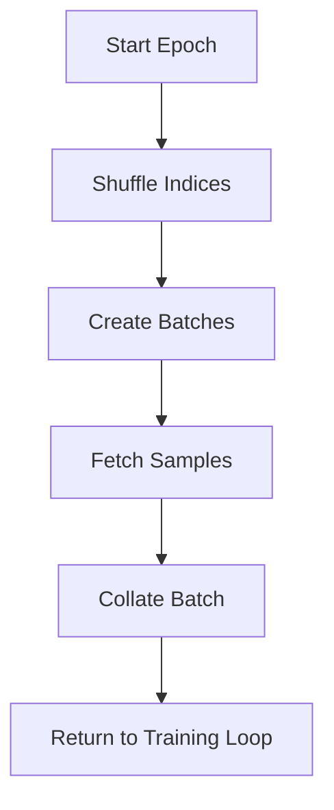

# Dataset & DataLoader Class in PyTorch

# Mini Batch Gradient Descent in PyTorch 🔄

## Overview 📚
Mini Batch Gradient Descent is an optimization technique that strikes a balance between Stochastic Gradient Descent (SGD) and Batch Gradient Descent by processing small batches of data at a time.

## Implementation Components 🛠️

### 1. Data Loading Structure
```python
from torch.utils.data import DataLoader, Dataset

# Create DataLoader for mini-batching
train_loader = DataLoader(
    dataset=train_dataset,
    batch_size=32,  # Mini-batch size
    shuffle=True    # Randomize data
)
```

### 2. Training Loop Architecture
```python
def train_model(model, train_loader, criterion, optimizer, epochs):
    for epoch in range(epochs):
        for batch_idx, (data, targets) in enumerate(train_loader):
            # Forward pass
            predictions = model(data)
            loss = criterion(predictions, targets)
            
            # Backward pass
            optimizer.zero_grad()  # Clear previous gradients
            loss.backward()        # Compute gradients
            optimizer.step()       # Update weights
```

## Key Advantages 🎯

### Performance Benefits
- **Memory Efficiency**: Processes smaller chunks of data
- **Training Speed**: Faster convergence than batch gradient descent
- **Noise Reduction**: More stable than pure stochastic gradient descent

### Implementation Benefits
- **Parallelization**: Efficient GPU utilization
- **Regularization**: Natural noise in mini-batches helps generalization
- **Memory Management**: Better control over memory consumption

## Practical Considerations 🤔

### 1. Batch Size Selection
| Batch Size | Impact |
|------------|---------|
| Smaller (16-32) | More noise, better generalization |
| Medium (64-256) | Good balance of speed/stability |
| Larger (512+) | More stable, might overfit |

### 2. Code Example with Best Practices
```python
import torch
import torch.nn as nn

class NeuralNetwork(nn.Module):
    def __init__(self):
        super().__init__()
        self.network = nn.Sequential(
            nn.Linear(784, 128),
            nn.ReLU(),
            nn.Linear(128, 10)
        )
    
    def forward(self, x):
        return self.network(x)

# Training configuration
model = NeuralNetwork()
criterion = nn.CrossEntropyLoss()
optimizer = torch.optim.Adam(model.parameters(), lr=0.001)
batch_size = 64

# Training with mini-batches
for epoch in range(num_epochs):
    for batch_x, batch_y in train_loader:
        optimizer.zero_grad()
        output = model(batch_x)
        loss = criterion(output, batch_y)
        loss.backward()
        optimizer.step()
```

## Optimization Tips 💡

1. **Dynamic Batch Sizing**
   - Start with smaller batches
   - Gradually increase based on convergence

2. **Memory Management**
   - Use `torch.cuda.empty_cache()` between epochs
   - Monitor GPU memory usage

3. **Performance Monitoring**
   - Track loss per mini-batch
   - Monitor gradient norms
   - Use learning rate scheduling

## Common Pitfalls to Avoid ⚠️

- Inconsistent batch sizes
- Not shuffling data between epochs
- Incorrect gradient clearing
- Poor learning rate selection

## Advanced Techniques 🚀

```python
# Learning rate scheduling
scheduler = torch.optim.lr_scheduler.ReduceLROnPlateau(
    optimizer, 
    mode='min', 
    patience=3,
    factor=0.1
)

# Gradient clipping
torch.nn.utils.clip_grad_norm_(model.parameters(), max_norm=1.0)
```
# PyTorch Data Challenges & Solutions 🔄

## 1. No Standard Interface for Data 📊

### The Challenge
```python
# Traditional approach (problematic)
data = [
    (image1, label1),
    (image2, label2)
    # Inconsistent structure
]
```

### Solution: Custom Dataset Class
```python
from torch.utils.data import Dataset

class CustomDataset(Dataset):
    def __init__(self, data_path):
        self.data = self._load_data(data_path)
        
    def __len__(self):
        return len(self.data)
        
    def __getitem__(self, idx):
        return self.data[idx]
        
    def _load_data(self, path):
        # Standardized data loading logic
        pass
```

## 2. Data Transformation Complexity 🔄

### Challenge Visualization


### Solution: Composable Transforms
```python
from torchvision import transforms

transform_pipeline = transforms.Compose([
    transforms.Resize((224, 224)),
    transforms.ToTensor(),
    transforms.Normalize(mean=[0.485], std=[0.229]),
    transforms.RandomHorizontalFlip(p=0.5),
])

class EnhancedDataset(Dataset):
    def __init__(self, data_path, transform=None):
        self.transform = transform
        self.data = self._load_data(data_path)
    
    def __getitem__(self, idx):
        sample = self.data[idx]
        if self.transform:
            sample = self.transform(sample)
        return sample
```

## 3. Shuffling and Sampling Management 🔀

### Efficient Implementation
```python
from torch.utils.data import DataLoader, RandomSampler

# Create sophisticated sampling strategy
sampler = RandomSampler(
    data_source=dataset,
    replacement=False,
    num_samples=None  # Use all samples
)

loader = DataLoader(
    dataset=dataset,
    batch_size=32,
    sampler=sampler,
    drop_last=True  # Handle incomplete batches
)
```

## 4. Batch & Parallelization Optimization ⚡

### Enhanced DataLoader Configuration
```python
loader = DataLoader(
    dataset=dataset,
    batch_size=32,
    num_workers=4,            # Parallel data loading
    pin_memory=True,         # Faster data transfer to GPU
    prefetch_factor=2,       # Pre-load future batches
    persistent_workers=True  # Keep workers alive
)
```

### Memory Management Strategies
```python
class MemoryEfficientDataset(Dataset):
    def __init__(self, data_path):
        self.data_path = data_path
        self.indices = self._create_index()
        
    def __getitem__(self, idx):
        # Load data on-demand
        return self._load_single_item(self.indices[idx])
        
    def _create_index(self):
        # Create lightweight index structure
        pass
```

## Advanced Optimization Techniques 🚀

### 1. Custom Collate Functions
```python
def custom_collate(batch):
    """Handle variable-sized data"""
    data = [item[0] for item in batch]
    target = [item[1] for item in batch]
    return torch.stack(data), torch.tensor(target)

loader = DataLoader(
    dataset=dataset,
    collate_fn=custom_collate
)
```

### 2. Dynamic Batch Sizing
```python
class DynamicBatchSampler(Sampler):
    def __init__(self, dataset, min_batch, max_batch):
        self.dataset = dataset
        self.min_batch = min_batch
        self.max_batch = max_batch
        
    def __iter__(self):
        # Implement dynamic batch size logic
        pass
```

## Performance Monitoring Dashboard 📊

| Metric | Tool | Purpose |
|--------|------|---------|
| Memory Usage | `torch.cuda.memory_stats()` | Track GPU memory |
| Load Time | `time.perf_counter()` | Measure data loading |
| Worker Efficiency | `torch.utils.data.DataLoader` logs | Monitor parallelization |

This comprehensive guide addresses the main challenges in PyTorch data handling with practical, optimized solutions and best practices for implementation.

# PyTorch Dataset and DataLoader: Core Data Handling Classes 🔄

## Dataset Class Blueprint 📘

### Core Components
```python
from torch.utils.data import Dataset

class CustomDataset(Dataset):
    def __init__(self, data_source):
        """Initialize data loading strategy"""
        self.data = self._load_data(data_source)
    
    def __len__(self):
        """Return total number of samples"""
        return len(self.data)
    
    def __getitem__(self, index):
        """Return single sample (and label)"""
        return self.data[index]
```

### Implementation Example 🛠️
```python
class ImageDataset(Dataset):
    def __init__(self, image_dir, transform=None):
        self.image_paths = glob.glob(f"{image_dir}/*.jpg")
        self.transform = transform
    
    def __len__(self):
        return len(self.image_paths)
    
    def __getitem__(self, idx):
        image = Image.open(self.image_paths[idx])
        if self.transform:
            image = self.transform(image)
        return image
```

## DataLoader Architecture 🚀

### Core Functionality
| Component | Purpose | Configuration |
|-----------|----------|--------------|
| Batching | Combines samples | `batch_size=32` |
| Shuffling | Randomizes order | `shuffle=True` |
| Parallel Loading | Multi-process data loading | `num_workers=4` |
| Memory Pinning | Optimizes GPU transfer | `pin_memory=True` |

### Control Flow Diagram


## Integration Example 💡

```python
# Dataset Definition
class TimeSeriesDataset(Dataset):
    def __init__(self, data, sequence_length):
        self.data = data
        self.sequence_length = sequence_length
    
    def __len__(self):
        return len(self.data) - self.sequence_length
    
    def __getitem__(self, idx):
        sequence = self.data[idx:idx + self.sequence_length]
        target = self.data[idx + self.sequence_length]
        return sequence, target

# DataLoader Configuration
loader = DataLoader(
    dataset=TimeSeriesDataset(data, sequence_length=10),
    batch_size=32,
    shuffle=True,
    num_workers=4,
    pin_memory=True,
    prefetch_factor=2
)

# Training Loop Integration
for epoch in range(num_epochs):
    for batch_data, batch_targets in loader:
        # Training step implementation
        pass
```

## Advanced Features & Best Practices ⚙️

### 1. Custom Collate Function
```python
def custom_collate(batch):
    """Customize batch formation"""
    data = torch.stack([item[0] for item in batch])
    targets = torch.tensor([item[1] for item in batch])
    return data, targets

loader = DataLoader(
    dataset,
    collate_fn=custom_collate
)
```

### 2. Sampler Configuration
```python
from torch.utils.data import WeightedRandomSampler

sampler = WeightedRandomSampler(
    weights=sample_weights,
    num_samples=len(dataset),
    replacement=True
)

loader = DataLoader(
    dataset,
    sampler=sampler
)
```

### 3. Memory Optimization Techniques
```python
# Optimized DataLoader configuration
loader = DataLoader(
    dataset,
    batch_size=32,
    num_workers=4,
    pin_memory=True,
    persistent_workers=True,
    prefetch_factor=2
)
```

## Performance Tips 🎯

1. **Optimal Worker Count**
   ```python
   num_workers = min(cpu_count(), 4 * torch.cuda.device_count())
   ```

2. **Memory Pinning**
   - Enable for GPU training
   - Disable for CPU-only training

3. **Batch Size Selection**
   - Start with power of 2
   - Adjust based on memory constraints

This comprehensive overview covers the essential aspects of PyTorch's data handling classes, providing both theoretical understanding and practical implementation guidelines.

