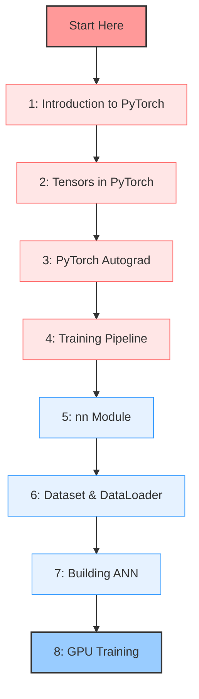

# 🔥 PyTorch Hindi Tutorial Series 🔥

<div align="center">
  
  <br>
  <p><strong>हिंदी में पायटॉर्च सीखें | Learn PyTorch in Hindi</strong></p>
  
  
  
  
  
</div>

## 📚 About This Course

Welcome to a comprehensive PyTorch tutorial series in Hindi! This course is designed to help you master PyTorch from basics to advanced concepts with clear explanations in Hindi language.

<blockquote>
<p>🧠 <strong>Why PyTorch?</strong> PyTorch has become the preferred deep learning framework for researchers and industry professionals due to its intuitive design, dynamic computation graph, and extensive ecosystem.</p>
</blockquote>

## 🎓 Course Curriculum

### 📘 Module 1: PyTorch Foundations
| 📺 Video | 📝 Title | 🎯 Topics Covered | 🔗 Resources |
|:--------:|----------|-------------------|--------------|
| 1️⃣ | [Introduction to PyTorch](https://youtu.be/QZsguRbcOBM?si=aPxFfQfwN6hondiT) | • Basic concepts<br>• Framework overview<br>• Setup & installation | [📝 Notes](1_Introduction%20to%20PyTorch.md) |
| 2️⃣ | [Tensors in PyTorch](https://youtu.be/mDsFsnw3SK4?si=EINeR-66hJPBM5LS) | • Tensor operations<br>• Data structures<br>• Basic manipulations | [📝 Notes](2_Tensors%20in%20PyTorch.md)<br>[📓 Notebook](2_tensors_in_pytorch.ipynb) |
| 3️⃣ | [PyTorch Autograd](https://youtu.be/BECZ0UB5AR0?si=fgLpkOoItgI1s8tm) | • Automatic differentiation<br>• Gradient computation<br>• Backpropagation | [📝 Notes](3_pytorch_autograd.md)<br>[📓 Notebook](3_pytorch_autograd.ipynb) |
| 4️⃣ | [PyTorch Training Pipeline](https://youtu.be/MKxEbbKpL5Q?si=GOC0-PKdo_bvL0JZ) | • Model training workflow<br>• Pipeline setup<br>• Training best practices | [📝 Notes](4_PyTorch%20Training%20Pipeline.md)<br>[📓 Notebook](4_pytorch_training_pipeline.ipynb) |

### 📗 Module 2: Neural Networks & Data
| 📺 Video | 📝 Title | 🎯 Topics Covered | 🔗 Resources |
|:--------:|----------|-------------------|--------------|
| 5️⃣ | PyTorch nn Module | • Neural network layers<br>• Building blocks<br>• Custom modules | [📝 Notes](5_PyTorch_nn_module.md) |
| 6️⃣ | Dataset & DataLoader | • Data handling<br>• Custom datasets<br>• Efficient loading | [📝 Notes](6_Dataset%20%26%20DataLoader%20Class%20in%20PyTorch.md)<br>[📓 Notebook](6_dataset_and_dataloader_demo.ipynb) |
| 7️⃣ | Building an ANN | • Neural network architecture<br>• Implementation<br>• Training | [📝 Notes](7_Building%20a%20ANN%20using%20PyTorch.md)<br>[📓 Notebook](7_ann-fashion-mnist-pytorch.ipynb) |
| 8️⃣ | GPU Training | • CUDA basics<br>• Performance optimization<br>• Multi-GPU training | [📝 Notes](8_Neural%20Network%20Training%20on%20GPU.md) |

## 🔍 Learning Path

<div align="center">



</div>

## 🚀 Quick Access Links

### 🔹 Entry Level
- [🎬 Introduction to PyTorch](https://youtu.be/QZsguRbcOBM?si=aPxFfQfwN6hondiT) - Start your journey here
- [💻 Tensors in PyTorch](https://youtu.be/mDsFsnw3SK4?si=EINeR-66hJPBM5LS) - The building blocks

### 🔹 Core Concepts
- [⚡ PyTorch Autograd](https://youtu.be/BECZ0UB5AR0?si=fgLpkOoItgI1s8tm) - The magic of automatic differentiation
- [🔄 PyTorch Training Pipeline](https://youtu.be/MKxEbbKpL5Q?si=GOC0-PKdo_bvL0JZ) - End-to-end model training workflow

### 🔹 Advanced Topics
- [🧠 Neural Networks with nn Module](5_PyTorch_nn_module.md) - Building complex architectures
- [📊 Dataset & DataLoader](6_Dataset%20%26%20DataLoader%20Class%20in%20PyTorch.md) - Handling data efficiently
- [🏆 Fashion MNIST Classification](7_ann-fashion-mnist-pytorch.ipynb) - Complete classification example
- [⚡ GPU Acceleration](8_Neural%20Network%20Training%20on%20GPU.md) - Supercharge your training

## 💡 Key PyTorch Concepts

<div align="center">
  <table>
    <tr>
      <th>Concept</th>
      <th>Description</th>
      <th>Importance</th>
    </tr>
    <tr>
      <td>📊 <strong>Tensors</strong></td>
      <td>Multi-dimensional arrays with gradient tracking capabilities</td>
      <td>⭐⭐⭐⭐⭐</td>
    </tr>
    <tr>
      <td>🔄 <strong>Autograd</strong></td>
      <td>Automatic differentiation system for computing gradients</td>
      <td>⭐⭐⭐⭐⭐</td>
    </tr>
    <tr>
      <td>🧩 <strong>nn Module</strong></td>
      <td>High-level neural network building blocks</td>
      <td>⭐⭐⭐⭐</td>
    </tr>
    <tr>
      <td>📈 <strong>Optimizers</strong></td>
      <td>Algorithms for updating model parameters during training</td>
      <td>⭐⭐⭐⭐</td>
    </tr>
    <tr>
      <td>📁 <strong>DataLoader</strong></td>
      <td>Efficient data loading and batching utilities</td>
      <td>⭐⭐⭐</td>
    </tr>
  </table>
</div>

## 📋 Prerequisites

<div align="center">
  <table>
    <tr>
      <th>Requirement</th>
      <th>Level</th>
      <th>Resources</th>
    </tr>
    <tr>
      <td>🐍 <strong>Python Basics</strong></td>
      <td>Intermediate</td>
      <td><a href="https://docs.python.org/3/tutorial/">Python Documentation</a></td>
    </tr>
    <tr>
      <td>🧮 <strong>Linear Algebra</strong></td>
      <td>Basic understanding</td>
      <td><a href="https://www.khanacademy.org/math/linear-algebra">Khan Academy</a></td>
    </tr>
    <tr>
      <td>📊 <strong>NumPy</strong></td>
      <td>Familiarity</td>
      <td><a href="https://numpy.org/doc/stable/user/absolute_beginners.html">NumPy Beginners Guide</a></td>
    </tr>
    <tr>
      <td>🧠 <strong>ML Concepts</strong></td>
      <td>Basic</td>
      <td><a href="https://www.coursera.org/learn/machine-learning">Andrew Ng's Course</a></td>
    </tr>
  </table>
</div>

## 📺 Detailed Video Breakdown

### 🎬 Video 1: Introduction to PyTorch
> **Learning Goals**
- Complete introduction to PyTorch framework
- Installation and setup guide
- Basic concepts and architecture
- Comparison with other frameworks

### 🎬 Video 2: Tensors in PyTorch
> **Learning Goals**
- Understanding tensor operations
- Working with PyTorch tensors
- Basic tensor manipulations
- Converting between NumPy arrays and PyTorch tensors

### 🎬 Video 3: PyTorch Autograd
> **Learning Goals**
- Automatic differentiation explained
- Working with computational graphs
- Understanding backpropagation
- Gradient tracking and optimization basics

### 🎬 Video 4: PyTorch Training Pipeline
> **Learning Goals**
- Building complete training workflows
- Understanding training cycles
- Implementing best practices
- Model optimization techniques
- Saving and loading models

## 🌟 Course Features

<div align="center">
  <table>
    <tr>
      <td align="center" width="200">
        
        <br>
        <strong>हिंदी में स्पष्टीकरण</strong>
        <br>
        Clear Hindi explanations
      </td>
      <td align="center" width="200">
        
        <br>
        <strong>व्यावहारिक कोडिंग</strong>
        <br>
        Practical coding examples
      </td>
      <td align="center" width="200">
        
        <br>
        <strong>चरणबद्ध सीखना</strong>
        <br>
        Step-by-step approach
      </td>
    </tr>
    <tr>
      <td align="center">
        
        <br>
        <strong>विषय-केंद्रित</strong>
        <br>
        Topic-specific deep dives
      </td>
      <td align="center">
        
        <br>
        <strong>प्रोजेक्ट आधारित</strong>
        <br>
        Project-based learning
      </td>
      <td align="center">
        
        <br>
        <strong>डाउट क्लीयरेंस</strong>
        <br>
        Comprehensive doubt clearing
      </td>
    </tr>
  </table>
</div>

## 📊 PyTorch vs Other Frameworks

<div align="center">
  <table>
    <tr>
      <th>Feature</th>
      <th>PyTorch</th>
      <th>TensorFlow</th>
      <th>Keras</th>
    </tr>
    <tr>
      <td>Dynamic Computation Graph</td>
      <td>✅ (Native)</td>
      <td>✅ (Eager mode)</td>
      <td>✅ (Via TF)</td>
    </tr>
    <tr>
      <td>Pythonic API</td>
      <td>✅✅✅</td>
      <td>✅✅</td>
      <td>✅✅✅</td>
    </tr>
    <tr>
      <td>Debugging Ease</td>
      <td>✅✅✅</td>
      <td>✅✅</td>
      <td>✅✅</td>
    </tr>
    <tr>
      <td>Production Deployment</td>
      <td>✅✅</td>
      <td>✅✅✅</td>
      <td>✅✅✅</td>
    </tr>
    <tr>
      <td>Research Popularity</td>
      <td>✅✅✅</td>
      <td>✅✅</td>
      <td>✅✅</td>
    </tr>
  </table>
</div>

## 🌐 Stay Connected

<div align="center">
  <a href="https://www.youtube.com/c/CampusX-official/featured" target="_blank"></a>
  &nbsp;&nbsp;&nbsp;
  <a href="https://www.linkedin.com/in/yash-kavaiya/" target="_blank"></a>
  &nbsp;&nbsp;&nbsp;
  <a href="https://github.com/Yash-Kavaiya" target="_blank"></a>
</div>

```python
def stay_updated():
    """
    Never miss an update!
    Subscribe and hit the notification bell 🔔
    """
    return "Happy Learning! 🚀"
```

## 💻 Installation Guide

```bash
# Create a virtual environment (recommended)
python -m venv pytorch-env
source pytorch-env/bin/activate  # On Windows: pytorch-env\Scripts\activate

# Install PyTorch with CUDA support (adjust according to your system)
pip install torch torchvision torchaudio --index-url https://download.pytorch.org/whl/cu118

# Verify installation
python -c "import torch; print(f'PyTorch version: {torch.__version__}'); print(f'CUDA available: {torch.cuda.is_available()}')"
```

---

<div align="center">
  <p><strong>💡 Pro Tip:</strong> Watch videos in sequence for the best learning experience!</p>
  <p>Happy Learning! Keep exploring PyTorch! 💻</p>
</div>
