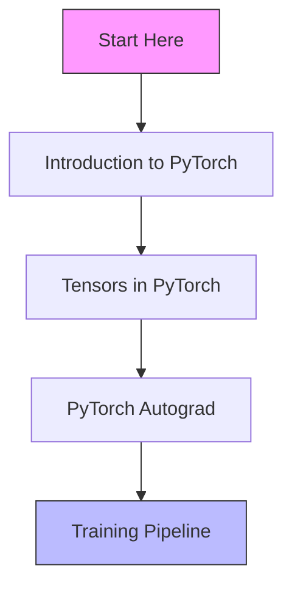

# PyTorch Hindi Tutorial Series 🔥

Welcome to a comprehensive PyTorch tutorial series in Hindi! This course is designed to help you master PyTorch from basics to advanced concepts.

## 📚 Course Contents 

### Module 1: Foundations & Training
| 📺 Video | 📝 Title | 🎯 Topics Covered |
|-------|-------|----------------|
| 1️⃣ | [Introduction to PyTorch](https://youtu.be/QZsguRbcOBM?si=aPxFfQfwN6hondiT) | • Basic concepts<br>• Framework overview<br>• Setup & installation |
| 2️⃣ | [Tensors in PyTorch](https://youtu.be/mDsFsnw3SK4?si=EINeR-66hJPBM5LS) | • Tensor operations<br>• Data structures<br>• Basic manipulations |
| 3️⃣ | [PyTorch Autograd](https://youtu.be/BECZ0UB5AR0?si=fgLpkOoItgI1s8tm) | • Automatic differentiation<br>• Gradient computation<br>• Backpropagation |
| 4️⃣ | [PyTorch Training Pipeline](https://youtu.be/MKxEbbKpL5Q?si=GOC0-PKdo_bvL0JZ) | • Model training workflow<br>• Pipeline setup<br>• Training best practices |

## 🔗 Quick Access Links

### 📘 Beginner Track
- [🎓 Introduction to PyTorch](https://youtu.be/QZsguRbcOBM?si=aPxFfQfwN6hondiT)
- [💻 Tensors in PyTorch](https://youtu.be/mDsFsnw3SK4?si=EINeR-66hJPBM5LS)

### 🎯 Advanced Track
- [⚡ PyTorch Autograd](https://youtu.be/BECZ0UB5AR0?si=fgLpkOoItgI1s8tm)
- [🔄 PyTorch Training Pipeline](https://youtu.be/MKxEbbKpL5Q?si=GOC0-PKdo_bvL0JZ)

## 🛣️ Learning Path



## 📋 Prerequisites

- ✅ Basic Python knowledge
- ✅ Understanding of mathematics fundamentals
- ✅ Enthusiasm to learn! 🚀

---

## 📺 Detailed Video Breakdown

### Video 1: Introduction to PyTorch
> 🎯 **Learning Goals**
- Complete introduction to PyTorch framework
- Installation and setup guide
- Basic concepts and architecture

### Video 2: Tensors in PyTorch
> 🎯 **Learning Goals**
- Understanding tensor operations
- Working with PyTorch tensors
- Basic tensor manipulations

### Video 3: PyTorch Autograd
> 🎯 **Learning Goals**
- Automatic differentiation explained
- Working with computational graphs
- Understanding backpropagation

### Video 4: PyTorch Training Pipeline
> 🎯 **Learning Goals**
- Building complete training workflows
- Understanding training cycles
- Implementing best practices
- Model optimization techniques

---

## 🌟 Features of This Course

| Feature | Description |
|---------|-------------|
| 🎥 Video Format | Clear, concise Hindi explanations |
| 💻 Hands-on | Practical coding examples |
| 🔄 Progressive | Step-by-step learning approach |
| 🎯 Focused | Topic-specific deep dives |

## 🌐 Stay Connected

```python
def stay_updated():
    """
    Never miss an update!
    Subscribe and hit the notification bell 🔔
    """
    return "Happy Learning! 🚀"
```

---

*Happy Learning! Keep exploring PyTorch! 💻*

> 💡 **Pro Tip**: Watch videos in sequence for the best learning experience!
